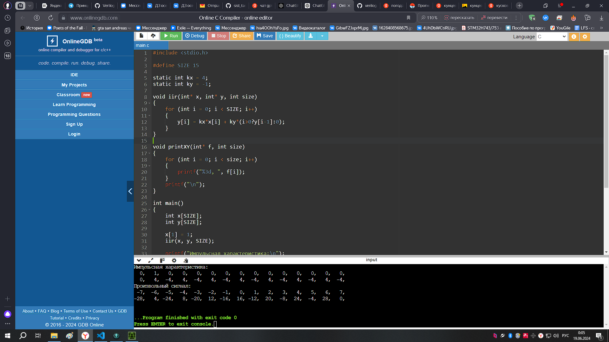
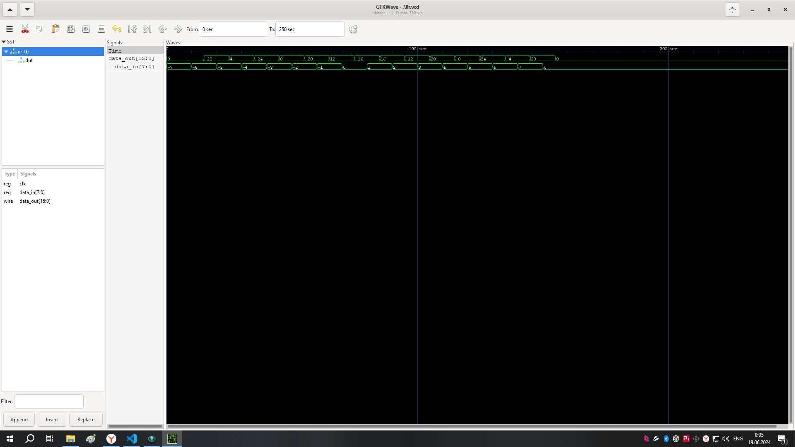

# 3 Реализовать БИХ фильтр вида y(k+1) = a*y(k) + b*x(k+1).
Размерность x, a, b составляет 8 бит,
знаковые целые числа. a, b известны заранее, в процессе работы не меняются.
Обосновать размерность результата.
Данные на вход поступают каждый такт. Операция умножения занимает два такта. 
Проверка программы на C:

Результат работы:
