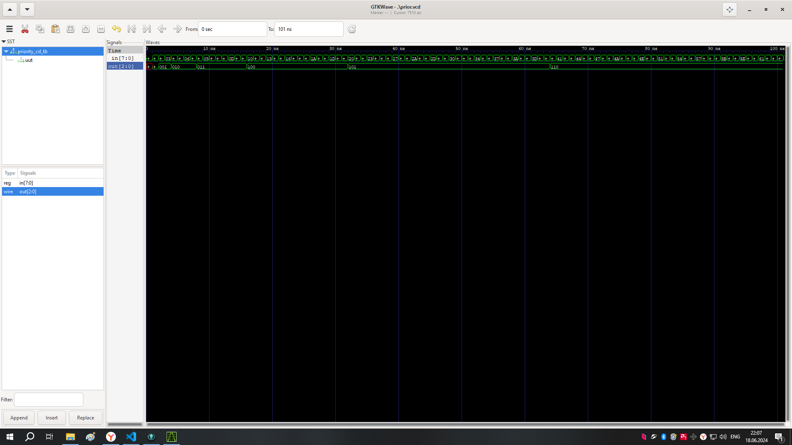
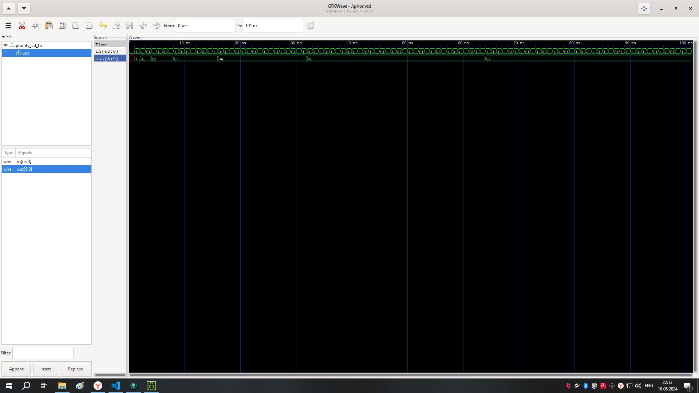

# 7 Реализовать модуль, который находит позицию старшего единичного бита в входном числе.
а) Продемонстрировать, каким образом полученное решение масштабируется при
неограниченном росте размерности входа (Достаточно показать на примере входа 32 или 64
бита). Данные поступают каждый такт.
б) Реализовать модуль, где ширина входных данных будет задаваться как параметр.
Пример для 8 бит:

Пример для 32 бит:

Пример для 64 бит:
