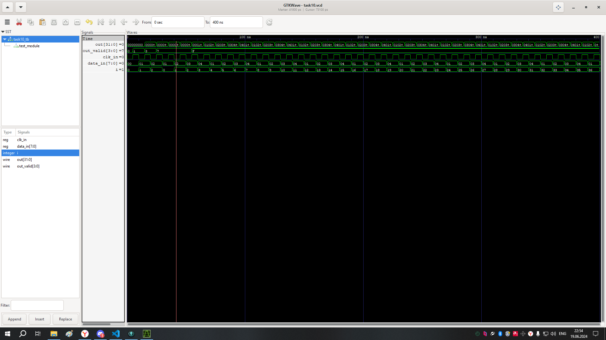

#  Реализовать модуль, который выводит на экран 4 последних уникальных значения из
входного потока данных. Значения на выходе должны быть отсортированы по времени,
прошедшему с момента их получения. Активные выходы должны быть отмечены сигналом
валидности.
